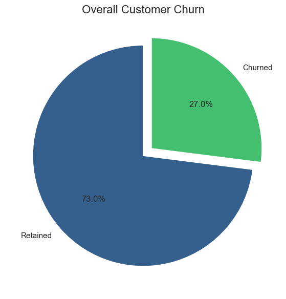
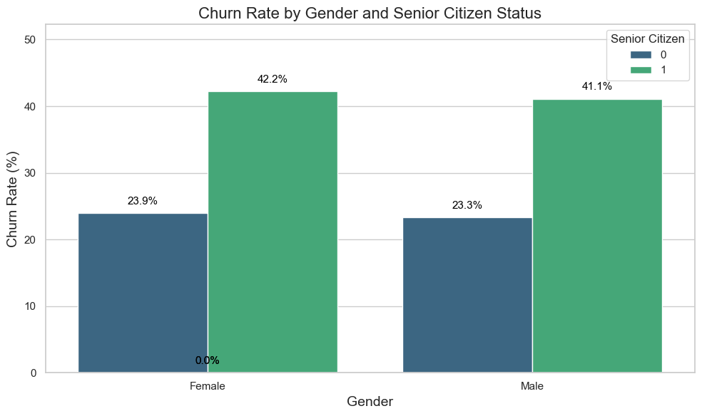
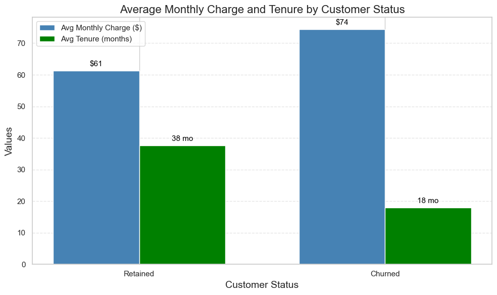

# telco-customer-churn-analysis
Analyzing customer churn and retention patterns using SQL

## Project Title

**Telco Customer Churn Analysis – Using SQL for Business Insights**

## 1. Project Overview

This project analyzes the Telco Customer Churn dataset to understand the factors influencing customer retention and attrition. Using SQL, the analysis uncovers patterns related to customer demographics, contract types, tenure, and charges, helping telecom companies identify at-risk customers and improve loyalty.

## 2. Dataset

Source: [Telco Customer Churn Dataset on Kaggle](https://www.kaggle.com/datasets/blastchar/telco-customer-churn?resource=download)

| Column          | Description                                      |
|-----------------|--------------------------------------------------|
| customerID      | Unique ID for each customer                      |
| gender          | Customer gender                                  |
| SeniorCitizen   | Whether the customer is senior (1 = yes)        |
| Partner         | Has partner (Yes/No)                             |
| Dependents      | Has dependents (Yes/No)                          |
| tenure          | Number of months with the company               |
| Contract        | Contract type (Month-to-month / 1 year / 2 year)|
| MonthlyCharges  | Monthly subscription cost                        |
| TotalCharges    | Total charges paid by customer                  |
| Churn           | Whether the customer left (Yes/No)              |


## 3. Methodology
- Data cleaning
- Exploratory data analysis (EDA) & Python’s matplotlib and seaborn used for trends and patterns visualization.
- Core analysis & Visualization: Python’s matplotlib and seaborn used for trends and patterns visualization.

## 4. KEy analysis
# 4.1 Overview
- **Churn rate:** ~27% of customers left.
- **Total cutomers:** 7043
- **Churn rate:** ~27%
```SQL
--Churn Rate
SELECT 
  COUNT(*) AS total_customers,
  SUM(CASE WHEN Churn = 'Yes' THEN 1 ELSE 0 END) AS churned_customers,
  ROUND(100.0 * SUM(CASE WHEN Churn = 'Yes' THEN 1 ELSE 0 END) / COUNT(*), 2) AS churn_rate
FROM Telco_Customer_Churn;
```


------
## 4.2 Churn by Demographics
- **Senior citizens** have significantly higher **churn (~42%)** compared to non-seniors (~23%). **Gender** differences are **minimal**.
```SQL
SELECT 
  gender,
  SeniorCitizen,
  COUNT(*) AS total,
  SUM(CASE WHEN Churn = 'Yes' THEN 1 ELSE 0 END) AS churned,
  ROUND(100.0 * SUM(CASE WHEN Churn = 'Yes' THEN 1 ELSE 0 END) / COUNT(*), 2) AS churn_rate
FROM Telco_Customer_Churn
GROUP BY gender, SeniorCitizen
ORDER BY churn_rate DESC;
```


## 4.3 Churn by Contract Type & Tenure
- Month-to-month contracts have highest churn, especially in the first 12 months.
- Longer-term contracts (1-year, 2-year) show much lower churn.
```SQL
SELECT 
  Contract,
  tenure_group,
  COUNT(*) AS total,
  SUM(CASE WHEN Churn = 'Yes' THEN 1 ELSE 0 END) AS churned,
  ROUND(100.0 * SUM(CASE WHEN Churn = 'Yes' THEN 1 ELSE 0 END) / COUNT(*), 2) AS churn_rate
FROM Telco_Customer_Churn
GROUP BY Contract, tenure_group
ORDER BY Contract, tenure_group;
```


## 4.4 Average Monthly Charges & Tenure
- Customers who churn tend to pay higher monthly charges but have shorter tenure, indicating early dissatisfaction or higher cost sensitivity.
  
```SQL
SELECT 
  Churn,
  ROUND(AVG(MonthlyCharges), 2) AS avg_monthly_charge,
  ROUND(AVG(TotalCharges), 2) AS avg_total_charge,
  ROUND(AVG(tenure), 2) AS avg_tenure
FROM Telco_Customer_Churn
GROUP BY Churn;
```


## 4.5 Top 10 High-Risk Customers
**Useful for targeted retention strategies.**

```SQL
SELECT 
  customerID,
  Contract,
  tenure,
  MonthlyCharges,
  TotalCharges,
  InternetService
FROM Telco_Customer_Churn
WHERE Churn = 'Yes'
ORDER BY MonthlyCharges DESC, tenure ASC
LIMIT 20;
```

| CustomerID   | Contract       | Tenure (months) | Monthly Charges ($) | Total Charges ($) | Internet Service |
|--------------|----------------|----------------|------------------|-----------------|----------------|
| 8199-ZLLSA   | One year       | 67             | 118.35           | 7804.15         | Fiber optic     |
| 2889-FPWRM   | One year       | 72             | 117.80           | 8684.80         | Fiber optic     |
| 2302-ANTDP   | Month-to-month | 48             | 117.45           | 5438.90         | Fiber optic     |
| 9053-JZFKV   | Two year       | 67             | 116.20           | 7752.30         | Fiber optic     |
| 1444-VVSGW   | One year       | 70             | 115.65           | 7968.85         | Fiber optic     |
| 0201-OAMXR   | One year       | 70             | 115.55           | 8127.60         | Fiber optic     |
| 4361-BKAXE   | Month-to-month | 41             | 114.50           | 4527.45         | Fiber optic     |
| 1555-DJEQW   | Two year       | 70             | 114.20           | 7723.90         | Fiber optic     |
| 9158-VCTQB   | Month-to-month | 41             | 113.60           | 4594.95         | Fiber optic     |
| 7279-BUYWN   | Month-to-month | 41             | 113.20           | 4689.50         | Fiber optic     |


## 5. Key Insights & Recommendations

- Target Month-to-Month and Senior Customers.

- Early Engagement: Customers tend to churn within the first year, onboarding and early support are crucial.

- High-Paying Customers at Risk: loyalty discounts or personalized offers to retain high-value customers.

- Contract Incentives: longer-term contracts for new customers to reduce early churn.

